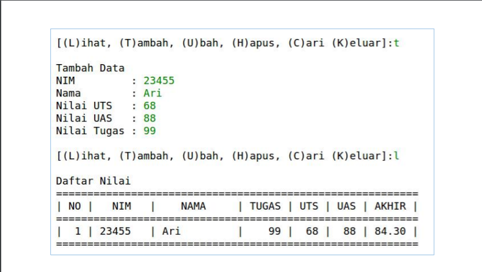

# Tugas pertemuan9 - pratikum 5

Pada pertemuan 9 praktikum 5 Dosen memberikan saya tugas untuk membuat program sederhana yang akan menampilkan daftar nilai mahasiswa. Berikut soal yang di berikan :


<hr>
Nama  : Nova Tegar Adiyansyah <br>
Nim   : 312010145 <br>
Kelas : TI.20.A.1 <br>
<hr>

## Penjelasan Pertemuan 9 P-5
1. Penggunaan 'if c.lower()' <br>
>`if c.lower()` fungsinya apabila user menginputkan denga huruf besar, maka otomatis akan menjadi huruf kecil sehingga kondisi yang digunakan tercapai. Contoh :

``` python
if c.lower() == `q`
```
2. Penggunaan `while True`

> `while True` berfungsi untuk mendeteksi jika format yang diinputkan bukan berupa type maka akan muncul error
<br>

3. Penggunaan `else`
> Fungsi `else` jika tidak error dan type yang dimasukan sesuai maka proses `while True` <br>

4. Penggunaan `valuveError`
> Fungsinya apabila diinputkan bukan berupa type maka hasil nya error (`valueError`) <br>

>Berikut syntax/source code :
